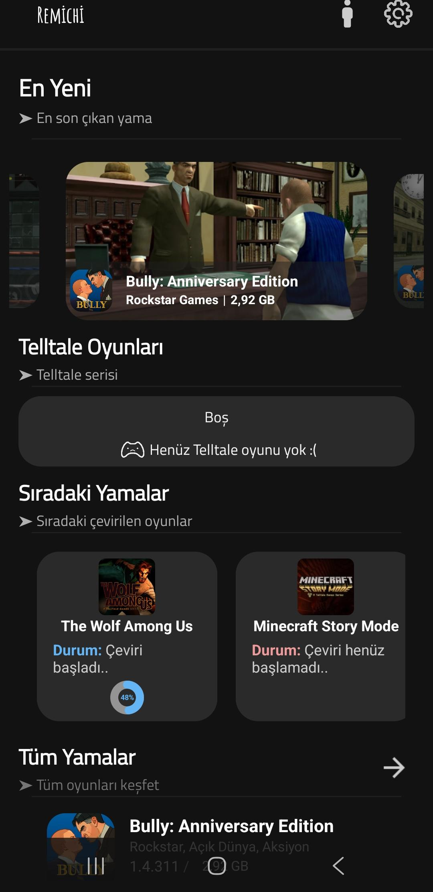
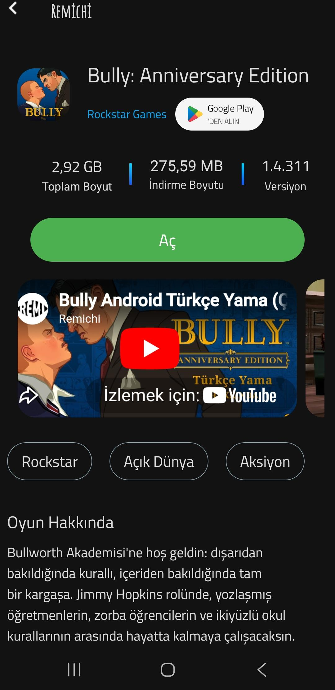
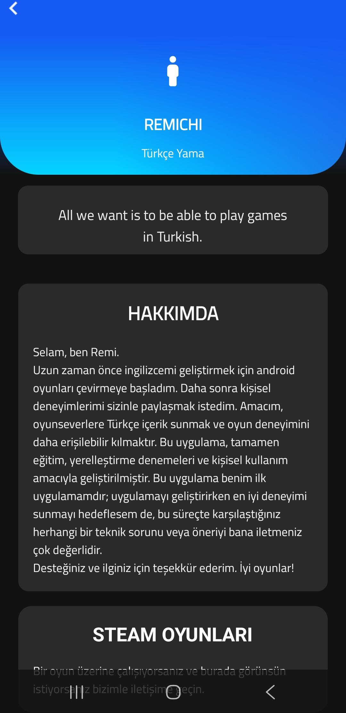

# Remichi 🇹🇷 / 🇬🇧

*[English version is below.](#english-version)*

---

## 🇹🇷 Türkçe (Turkish)

Remichi, çeşitli Android oyunlarını Türkçe olarak deneyimlemenizi sağlayan bir uygulamadır. Oyun ve Türkçe yama birlikte APK şeklinde kullanıcıya sunulur. Amacımız, kullanıcıların oyunları Türkçe olarak deneyimlemesini sağlamak ve kolay erişim sunmaktır.

### Özellikler
- Android oyunları için Türkçe dil desteği.
- Kolay indirme ve kurulum.
- Tamamen ücretsiz (Eğitim ve kişisel kullanım amaçlı).
- Cihazınızdan hiçbir veri toplamaz (Gizlilik odaklı).

### İndirme ve Kurulum
1. [Releases](../../releases) sayfasına gidin ve `Remichi_1.0.apk` dosyasını cihazınıza indirin.
2. Cihazınızda "Bilinmeyen Kaynaklardan Yükleme" izninin açık olduğundan emin olun (Ayarlar > Güvenlik veya Uygulamalar).
3. APK dosyasına tıklayarak kurulumu tamamlayın.
4. Uygulamayı açarak desteklenen oyunları Türkçe oynamaya başlayın!

### Ekran Görüntüleri

  
  
  

### İletişim & Sosyal Medya
- **Telegram**: [Remichi Telegram Grubu](https://t.me/+ezIDcLD8eaJiODU0)
- **YouTube**: [Remichi TR](https://youtube.com/@remichitr?si=XJ-UUkQFKSxWP7oE)
- **E-posta**: remichisup@gmail.com

### Lisans ve Kullanım Şartları
Tüm detaylar için [LICENSE](LICENSE) dosyasına göz atabilirsiniz.
- Uygulama ticari amaçlarla kullanılamaz.
- Uygulamadaki dosyalar yeniden paylaşılamaz, satılamaz veya dağıtılamaz.
- Oyunları seviyorsanız lütfen orijinal geliştiriciden satın alın.

---

## EN English

Remichi is an application that allows you to experience various Android games in Turkish. The game and its Turkish patch are provided together as an APK file. Our goal is to make it easier for users to experience games in Turkish with easy access.

### Features
- Turkish language support for Android games.
- Easy download and installation.
- Completely free (For educational and personal use only).
- Does not collect any data from your device (Privacy-focused).

### Download and Installation
1. Go to the [Releases](../../releases) page and download the `Remichi_1.0.apk` file to your device.
2. Make sure you have enabled the "Install from unknown sources" permission on your device (Settings > Security or Apps).
3. Tap the APK file to complete the installation.
4. Open the app and start playing supported games in Turkish!

### Screenshots

  
  
  

### Contact & Social Media
- **Telegram**: [Remichi Telegram Group](https://t.me/+ezIDcLD8eaJiODU0)
- **YouTube**: [Remichi TR](https://youtube.com/@remichitr?si=XJ-UUkQFKSxWP7oE)
- **Email**: remichisup@gmail.com

### License and Terms of Use
For full details, please check the [LICENSE](LICENSE) file.
- The application cannot be used for commercial purposes.
- Files within the application cannot be redistributed, sold, or shared.
- If you like the games, please purchase them from the original developers.
